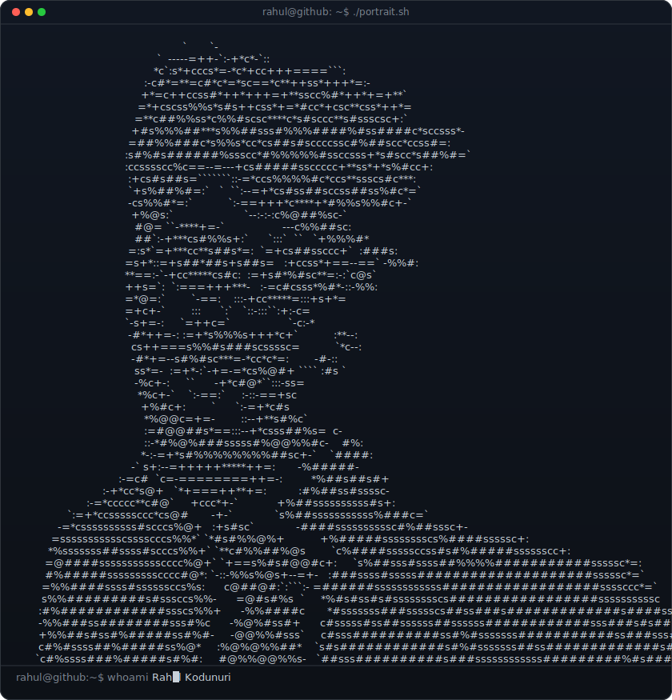
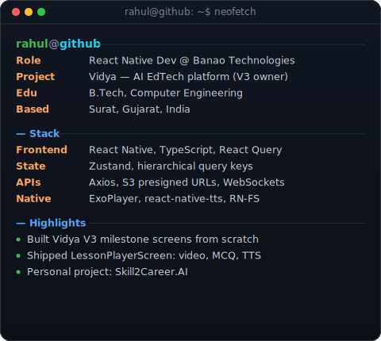

<!--
  This is your PROFILE README. It goes in a repo named exactly after your
  username (e.g. github.com/OCTOCAT/OCTOCAT) so GitHub shows it on your profile.
-->

<table>
<tr>
<td valign="top"></td>
<td valign="top"></td>
</tr>
</table>

## Rahul Kodunuri

**React Native Developer · Vidya (AI EdTech) · B.Tech Computer Engineering**

 

<!-- animated contribution graph, refreshed daily by the workflow -->

